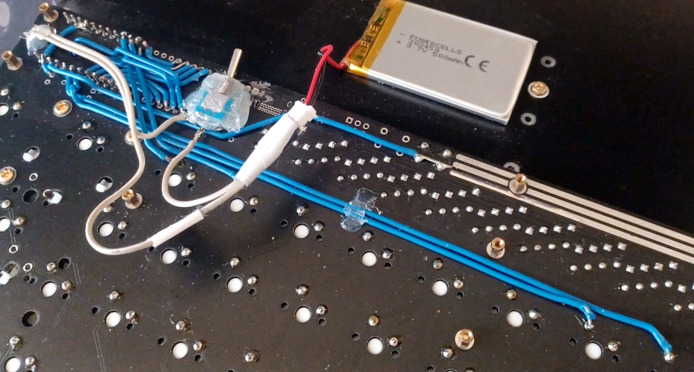
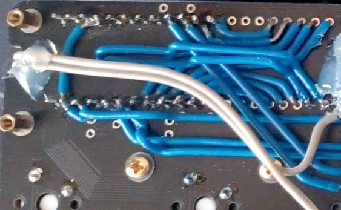
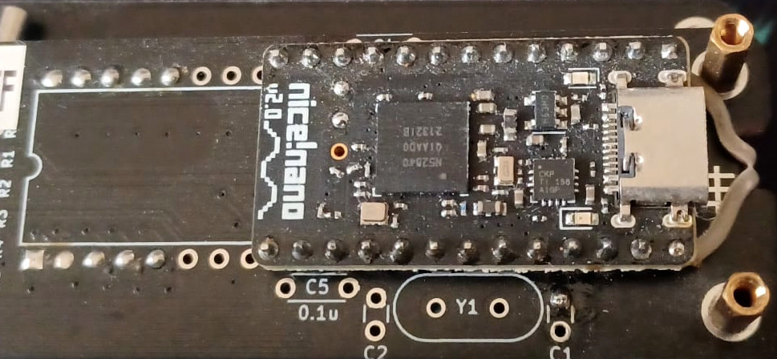

# Custom ZMK config

The PCB of the [discipline](https://github.com/coseyfannitutti/discipline) keyboard is used. 
The key matrix was wired to utilise a [nice!nano](https://nicekeyboards.com/nice-nano/) instead 
of the default µC. The goal was to add bluetooth support to an existing mechanical keyboard. 
The keyboard is mapped for the ISO-DE layout, although it can be remapped fairly easily.

# Images

